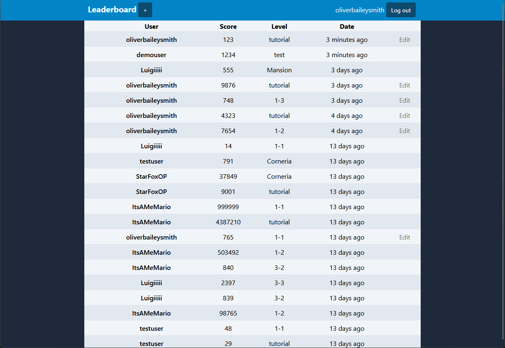

# leaderboard
A full-stack video game leaderboard application.<br/>
React frontend, Node/Express REST API with MongoDB database.<br/>
[Live deployment on render.com (please wait a minute for backend to spin up)](https://leaderboard-frontend-15hu.onrender.com/)
<br/>
```
Demo credentials:
Username: demouser
Password: demopassword
```
**Note - please read if unable to submit a score:**<br/>
For the purposes of CORS, "onrender.com" is considered an extension rather than a domain. As a result, the backend and frontend are on different domains, so I had to use `sameSite: none` attribute on the authentication cookie. Because of this, browsers will not save the cookie if third-party cookie blocking is enabled, and features requiring authentication such as submitting a new score will not work on the live deployment. I am planning to host the site on my own domain in the future to remedy this.
<br/><br/>

## Features
- React frontend
  - Responsive design using Tailwind
  - Form validation and smart error display
  - React router for routing
  - Pages for home, user, level, submit score, edit score, log in, sign up
  - Tooltips when hovering date to view full timestamp
  - Vite dev/build environment
- Node/Express/MongoDB backend
  - Routes to create, read, update, delete users and scores
  - Representational state transfer (REST) API
  - Users/scores collections in database
  - dotenv for environment variables
  - Custom error-handling middleware
  - Authentication/authorization using JSON Web Tokens, Bcrypt
- CORS handling and fetch API to connect frontend and backend
- Model-view-controller (MVC) architecture
- Live deployment on render.com
